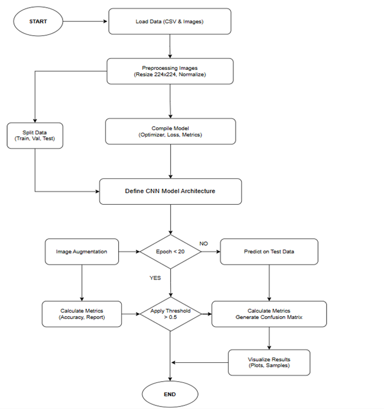
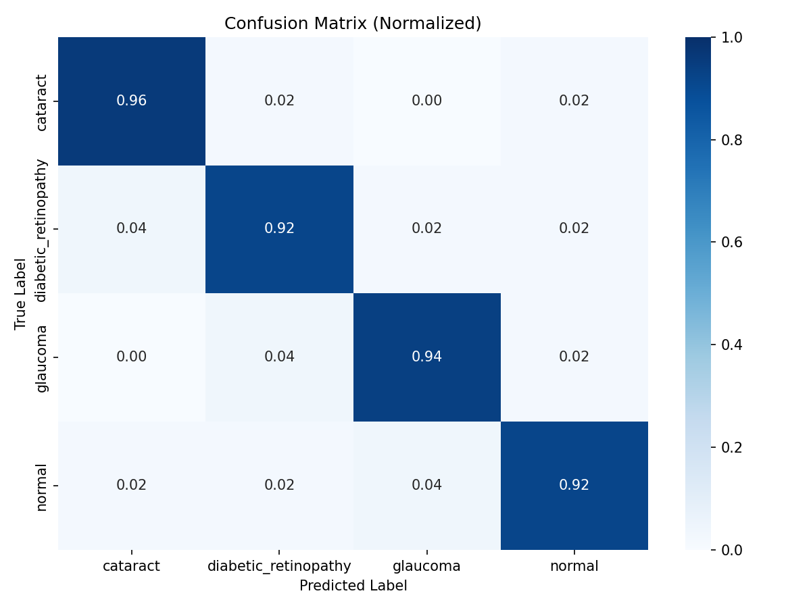
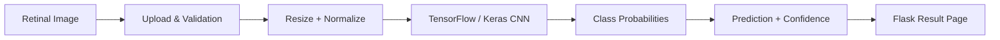

# Retinal Disease Classification Web Application

<p align="center">
  <strong>Computer vision + deep learning + Flask for retinal image classification</strong>
</p>

<p align="center">
  
  
  
  <a href="https://github.com/shaiksadik1725-droid/retinal-app/actions/workflows/python-syntax.yml"></a>
</p>

## Project at a Glance

| Item | Details |
|---|---|
| Domain | Medical image classification |
| Core approach | Convolutional neural network |
| Interface | Flask web application |
| Inputs | Retinal images |
| Output | Predicted class and confidence |
| Status | Academic / research prototype |

## Overview

This project combines image preprocessing, TensorFlow/Keras inference, and a browser-based Flask interface. A user uploads a retinal image, the application validates the input, preprocesses it for the trained model, and displays the predicted class with a confidence score.

## Visual Preview

<p align="center">
  
  
</p>

## Main Features

- CNN-based retinal image classification
- Browser-based image upload and inference
- Support for PNG, JPG, JPEG, BMP, and WebP
- Saved Keras model and class-index mapping
- Training and evaluation plots
- Prediction result page
- Health/status endpoint for deployment checks

## System Flow



## Technology Stack

- Python
- TensorFlow / Keras
- Flask
- NumPy
- Pillow
- HTML / CSS
- Gunicorn

## Repository Structure

```text
retinal-app/
├── app.py
├── predict.py
├── Train_Model_Plots.py
├── requirements.txt
├── models/
├── templates/
├── static/
├── dataset/
├── Images/
├── Model_Plots_Samples/
└── Model_Results/
```

## Run Locally

```bash
git clone https://github.com/shaiksadik1725-droid/retinal-app.git
cd retinal-app
pip install -r requirements.txt
python app.py
```

Then open:

```text
http://localhost:5000
```

## Model Evidence

The repository includes training curves, confusion matrices, classification-report files, and example predictions so model behavior can be inspected rather than presented only as a final application.

## Limitations

This is an academic research prototype. It has not been clinically validated and must not be used as a substitute for professional medical diagnosis.

## Future Work

- External validation on independent retinal datasets
- Grad-CAM or similar explainability methods
- Stronger dataset documentation and reproducibility
- Automated tests and CI
- Model/version tracking
- Deployment hardening

## Author

**Sadik Shaik**

Computer Engineering · Artificial Intelligence · Embedded Systems
